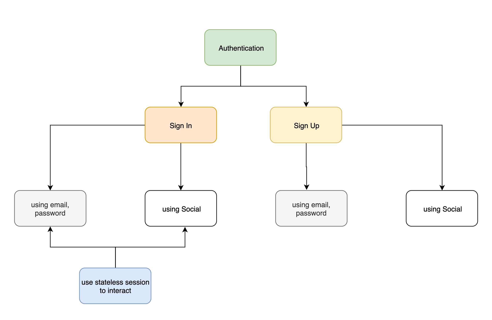

# NearbyShops

Nearby shops is an full application (back-end , front-end[web-mobile]) for SouqAlMal coding challenge

## API Specs

### Authentication

| #   | API            | Description         | Method | Params                   | header |
| --- | -------------- | ------------------- | ------ | ------------------------ | ------ |
| 1   | /api/v1/login  | to Sign in          | POST   | email, password          | N/A    |
| 2   | /api/v1/signup | to Sign up new user | POST   | email,password,cpassword | N/A    |

### Shops

| #   | API               | Description   | Method | Params | header |
| --- | ----------------- | ------------- | ------ | ------ | ------ |
| 1   | /api/v1/shops     | get all shops | GET    | N/A    | token? |
| 2   | /api/v1/shops/:id | update mode   | PATCH  | mode   | token  |

## run the application

### requirements

1. node
2. npm
3. mongodb

### server

1. `cd server`
2. change database url from config.json file
3. install deps by `npm install`
4. seed a dummy data by command `npm run seed`
5. run server `npm start`

### front

1. `cd nearby-shops`
2. install deps by `npm install`
3. run front server `npm start`
